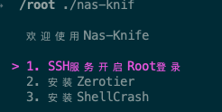
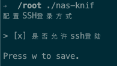

# NAS-KNIFE

> 夏天来了，我的硬盘居然比我先一步承受不住压力，意外地挂掉了。
> 作为一个垃圾佬，我实在不想购置一个好的硬盘安装，所以这使我不得不重装系统。
> 因此，我决定创建一个项目，将我日常在NAS上使用的命令集结成一个便捷的小工具箱。这样一来，我就可以减少敲点命令😭😭😭

## SSH-Server

躲在运营商后面的虚拟机要个毛安全，全都给我打开！！

> 会读取/etc/ssh/sshd_config文件的PermitRootLogin属性，只有yes和no两个选项，为啥没有别的？因为不会写 go都啥破语法





## Docker管理
看YY哥的博客抽象成了脚本 https://yqqy.top/blog/2024/docker-mirrors-cloudflare

## 命令行类
### 小片片切割器
使用FFMpeg对小片片进行切割，切成一段段的HLS文件, 合并成同一个数据文件，然后借助rclone上传到Alist中。
期间会生成：
1. out.m3u8 流文件
2. key.keyinfo 秘钥描述
3. encipher.key 秘钥
4. out.ts 加密过的视频文件

要求: 
1. 安装ffmpeg
2. 安装rclone并且配置好名称是webdav
3. 安装openssl，用于生成秘钥

命令如下: 

```shell
    nas-knife vl --alist http://ssssss \ 
    -t /aliyun/TS/ \ 
    -k /strm/av/ \
    -s /Downloads/SSIS-878.mp4 \ 
    -f SSIS-878
```

参数说明：
+ alist: 指定Host地址用于替换m3u8里面的文件为真实地址
+ t: 目标网盘的地址
+ k: 本地盘的地址，比如SMB，文件秘钥分开 天王老子来也不知道文件里是啥
+ s: 本地视频文件地址
+ f: 生成的目录名，比如番号？，SSIS-878这个骗子女主真的很顶

